# Davis Mobile Detailing

### Links:
[Demo Live Site](https://davismobiledetailingaz.com/)
 || 
[Github Repo](https://github.com/loganveik/davismobiledetailing)

### Description:
This is a site I designed & built for a client who owns a car detailing business. Met with him to plan his vision for the site, which included 3 public pages & a private admin dashboard. The dashboard grants him the ability to add: Projects, Reviews, Packages, and FAQs which immediately reflect on the public site.

### Technologies Used:
React(hooks/context), Firebase(auth/db/storage), HTML, CSS, Javascript, Node.js, Webpack, Formspree

### How to Use:
1) Home Page Hero
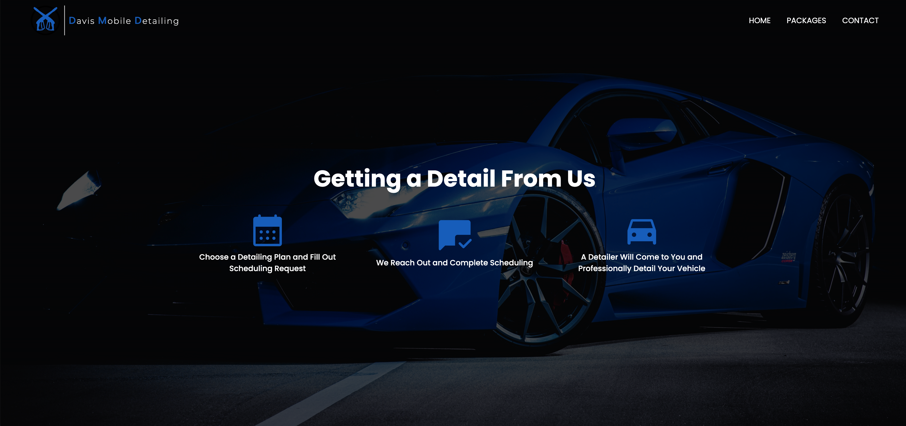
2) Home Page About Us
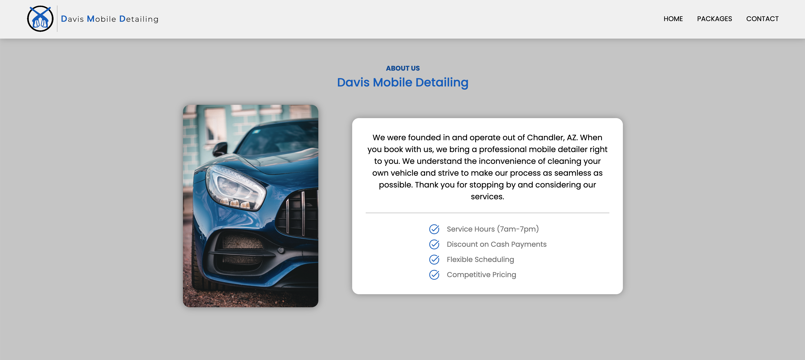
3) Home Page Projects & Banner

4) Home Page Reviews

5) Footer
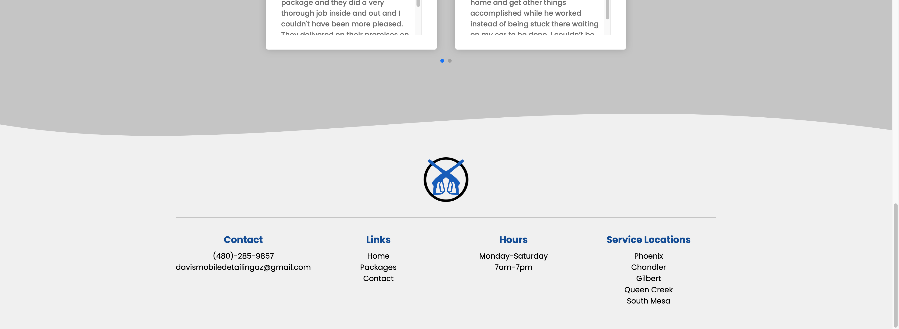
6) Packages Page Packages
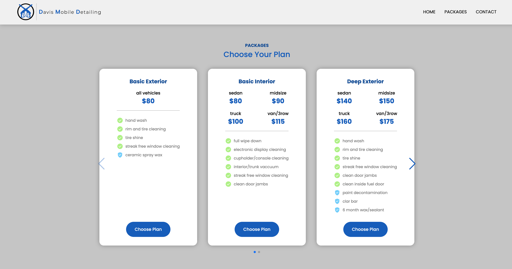
7) Packages Page Packages Contact Modal
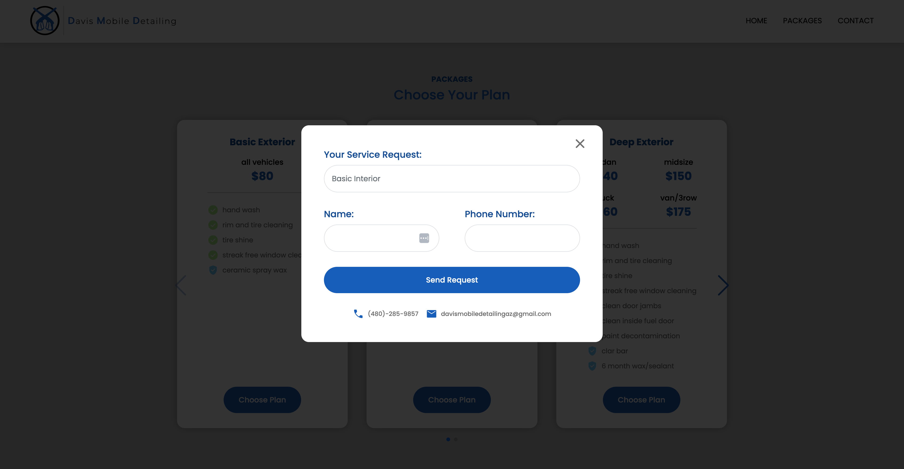
8) Packages Page Extra Info
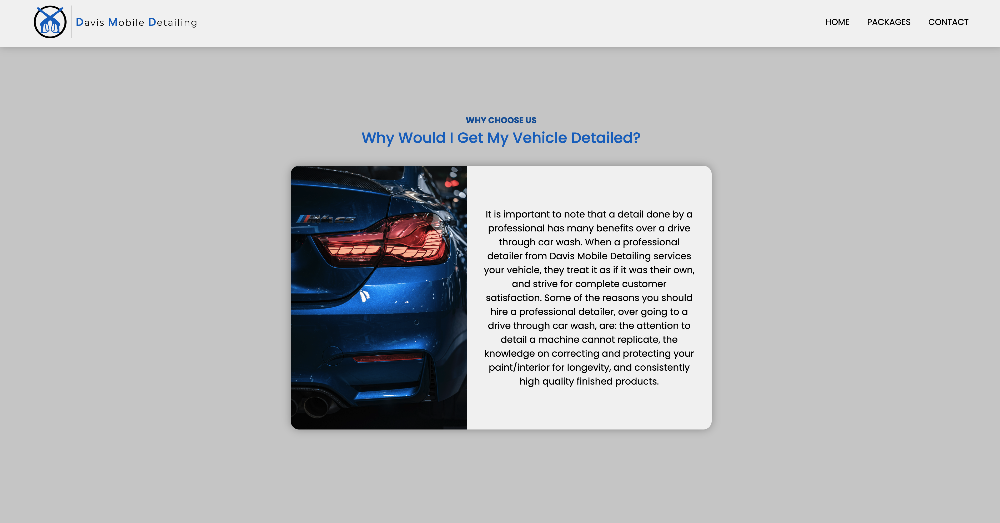
9) Packages Page FAQs
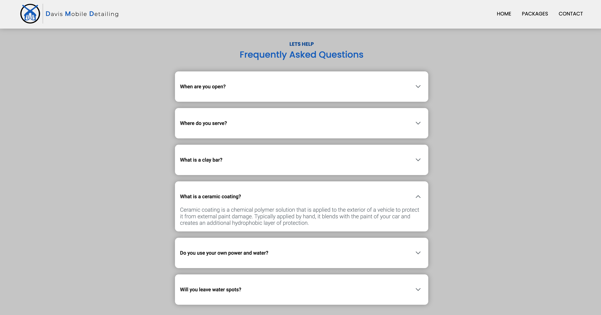
10) Contact Page
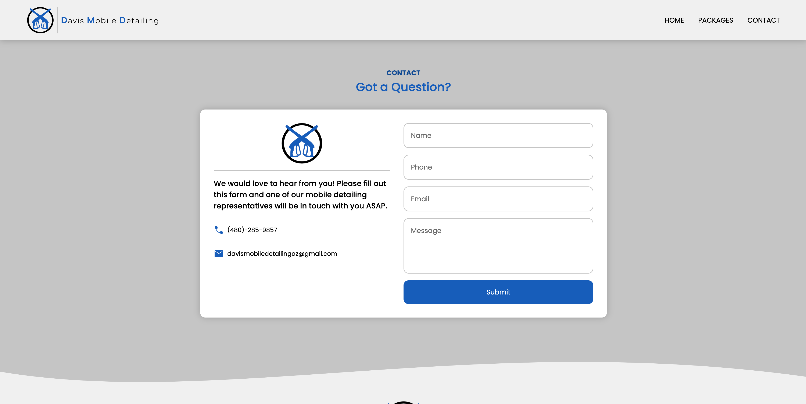
11) Client Login Page
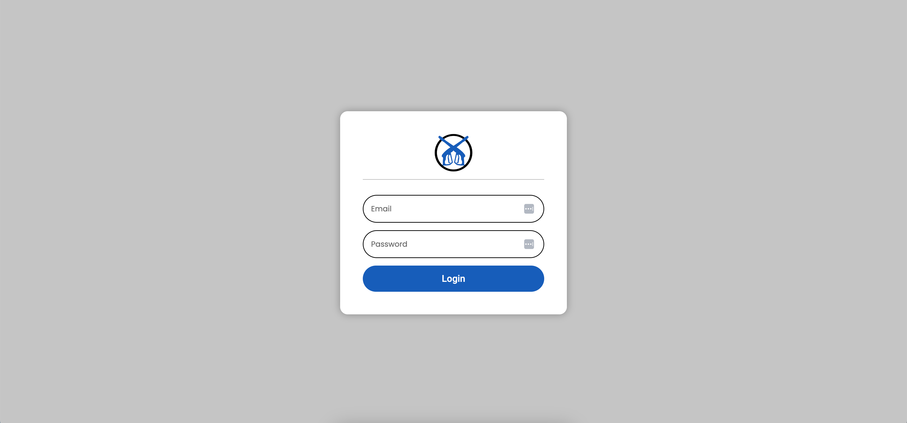
12) Client Dashboard - Projects(read/delete)
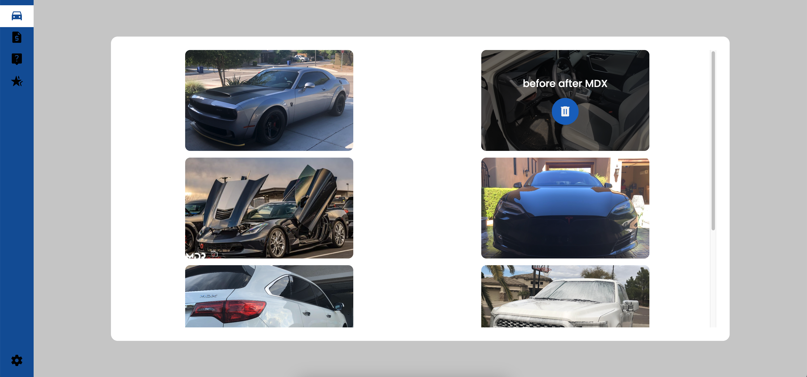
13) Client Dashboard - Packages(read/delete)
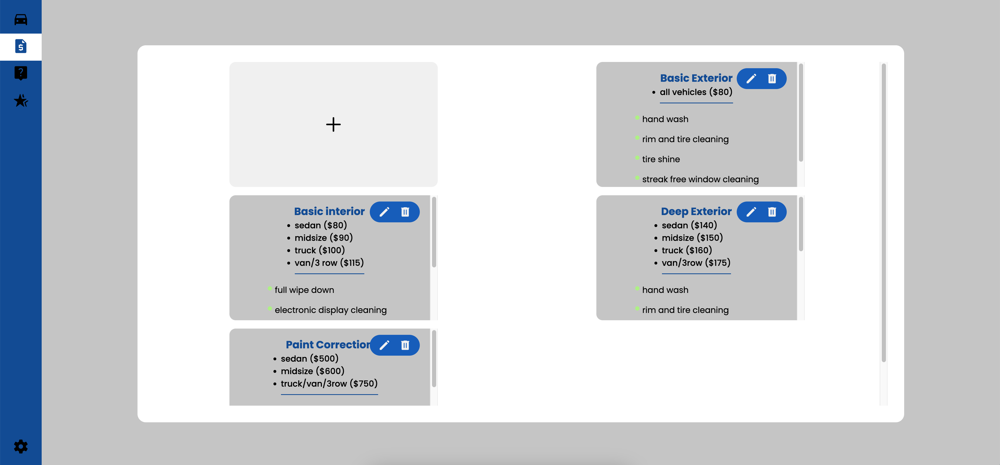
14) Client Dashboard - Packages(create)

15) Client Dashboard - Packages(update)
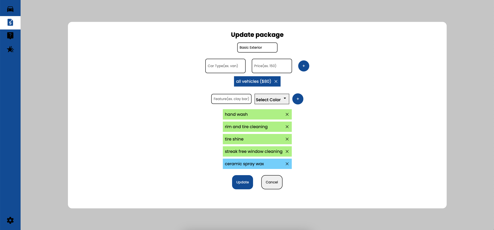
16) Client Dashboard - FAQs(read/delete)
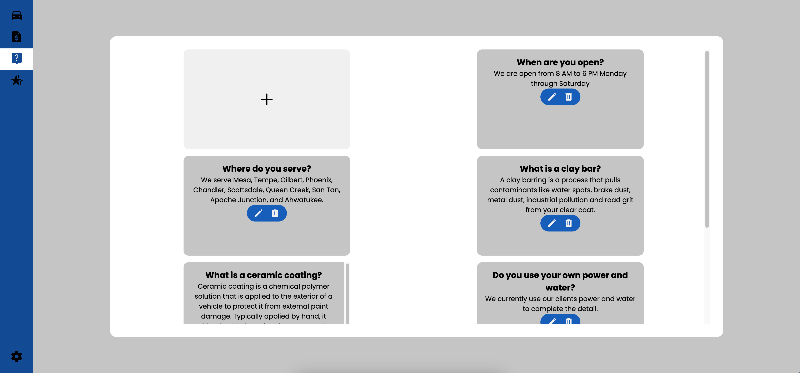
17) Client Dashboard - FAQs(create)
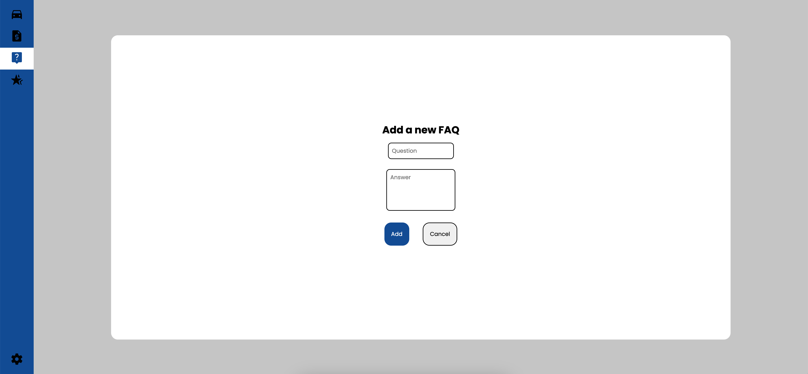
18) Client Dashboard - FAQs(update)
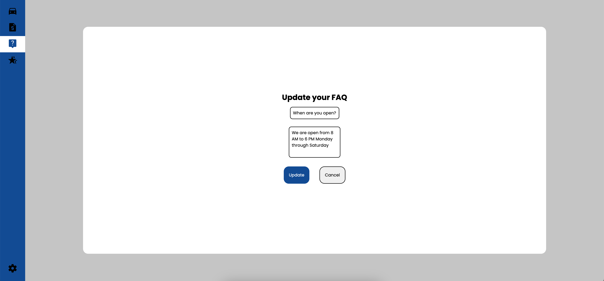
19) Client Dashboard - Reviews(read/delete)
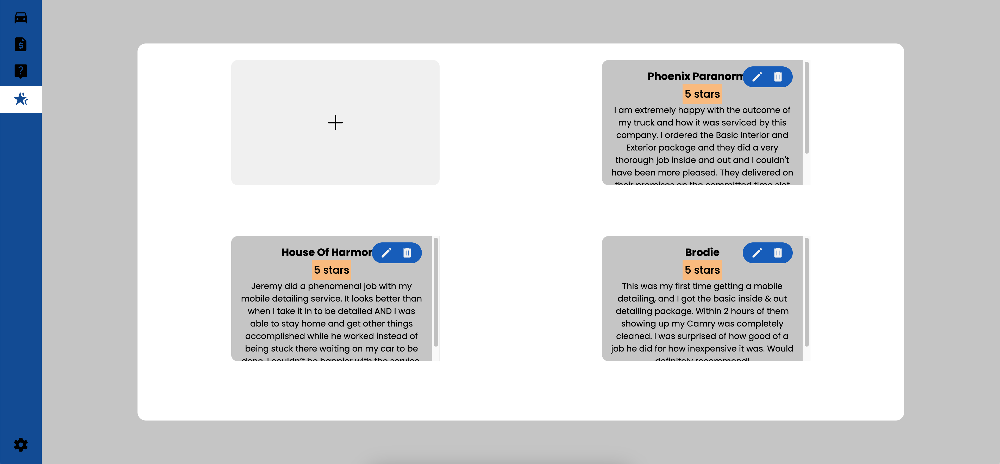
20) Client Dashboard - Reviews(create)
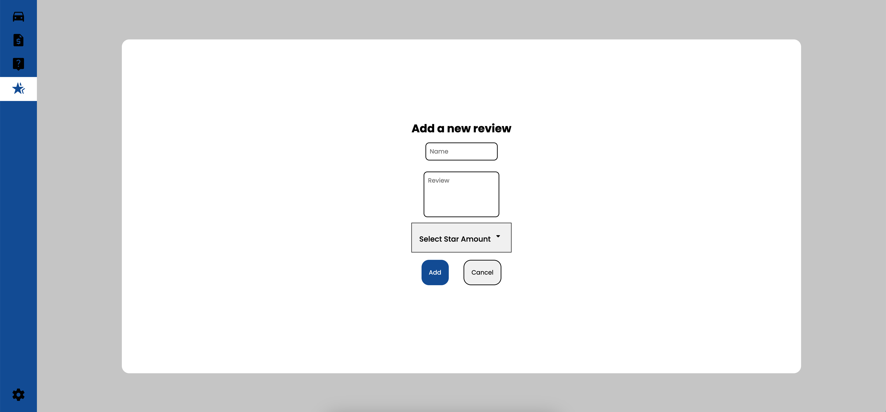
21) Client Dashboard - Reviews(update)
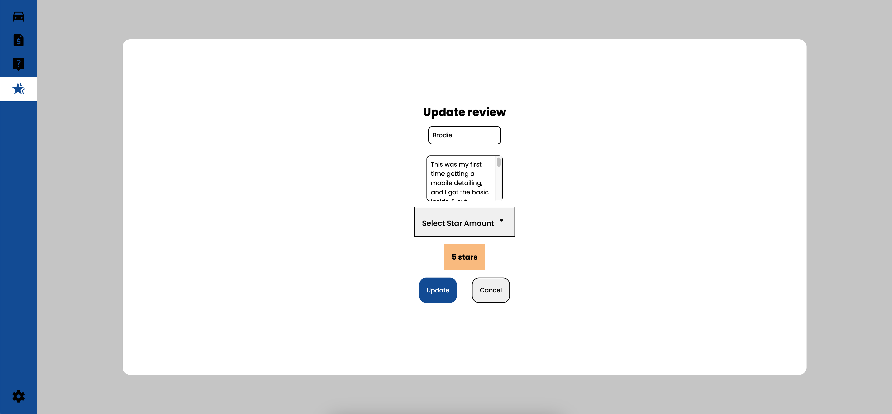